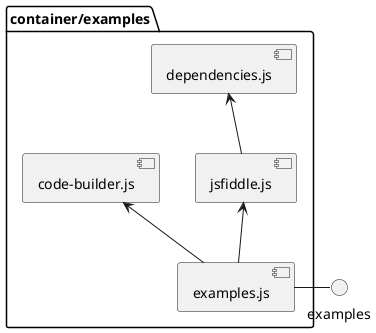

# Examples Container

For purpose of presenting demo snippets runs live.

## Dependency flow

PlantUML code

[Generator](https://www.planttext.com/)

```plantuml
@startuml

package "container/examples" {
  [dependencies.js]
  [code-builder.js]
  [jsfiddle.js]
  [examples.js]
}

interface "examples"

[examples] -left- [examples.js]
[examples.js] -up-> [code-builder.js]
[examples.js] -up-> [jsfiddle.js]
[jsfiddle.js] -up-> [dependencies.js]

@enduml
```

