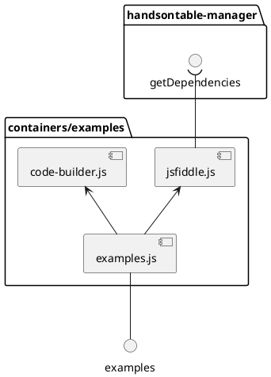
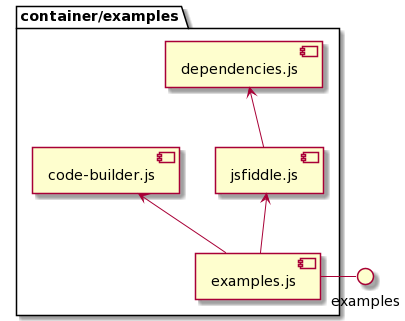

# Examples Container

For purpose of presenting demo snippets runs live.

## Dependency flow

PlantUML code

[Edit](https://www.planttext.com/?text=RP0n3eCm34NtdC9YwfBs1XL3Ru4OJ69eQ31H4YIaYhitK840CJxh-xyuUOZeuz1P8Hog3pO4cUevec7ouK4ZTivIoE0h00hLQvBLOAmcVsz3ES_QK1kjBQsyhYmy2SEHV8qgzMvbOYTx8-im2ojBiaDEG_-t0Uns6uelSiIQM9cvOaebcwi4EJXvSXze2JmlBhXC7Muwq9AuGN5wJob4dY3zumy0)

