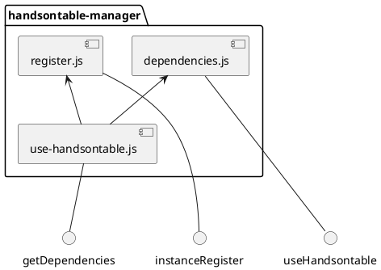
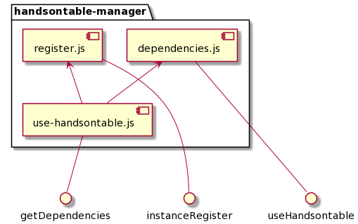

# Handsontable Manager

This module provides api to run any example in any handsontable version with selected preset. 
Secondary, it manages instances and allows to destroy them all.

## API:

### applyToWindow()

Apply useHandsontable and instanceRegister into window objects, which makes them global.

### getDependencies(version, preset)

Return array of dependencies. Each dependency has 2 or 3 elements: `[scriptUrl,[variables],stylesUrl?]`
Where `variables` mean which vars should be clean up if the dependency being unloaded.

### instanceRegister.listen()

Add global hook into Handsontable, which save all instances;

### instanceRegister.destroyAll()

Destroy all instances.

### useHandsontable(version, callback, preset='hot')

Add into head section all needed dependencies (js and css) for selected preset, and then run callback.

```js
useHandsontable('8.3.1', () => {
    const hot = new Handsontable(/* ... */);
    /* ... */
},'react-redux');
```

## Dependency flow

<details>
<summary>PlantUML code</summary>

[Edit](https://www.planttext.com/?text=VP6z3i8m38HtFqMKFJm2wi30p5encDIKG6kg_4o8TySY299Io7Z-uhkJcn3HnpGE01FQ2_Qaz0cv2rUEU1Z8ZCWYUgrkeEIr7Kt47R5r55RdiC-gfzw5IFwZf42cNFIStC6nK4UqOYF4jW1qENCikTZIxhMt6lOKDqKA3G2BTigaoQmN8l-bgohGpimozgDUEwiaSAQ_4ymBlj7Qlf5lSfm7)


</details>


