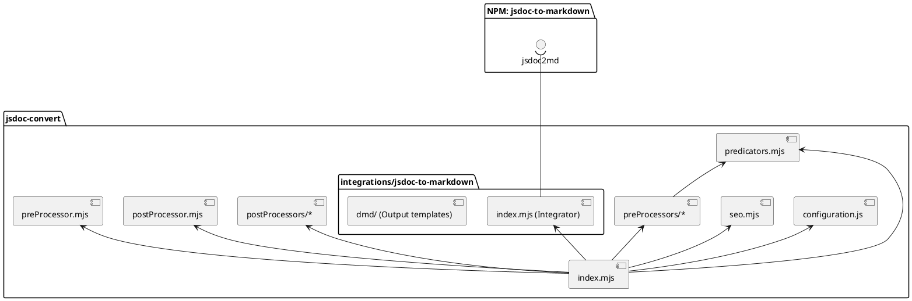

`node index.js` - generates API Reference

All configuration was moved into `configuration.js` file.

```js
module.exports = {
  pathToSource: '../../../../src',
  pathToDist: '../../../next/api',
  urlPrefix: '/next/api/',
  whitelist: [ /* ... */ ], // todo it will be removed.
  seo: {
    'dataMap/metaManager/metaSchema.js': {
      title: 'Options',
      metaTitle: 'Options - API Reference - Handsontable Documentation',
      permalink: '/next/api/options'
    },
    /* ... */
  },
  linkAliases: {
    options: 'metaSchema',
    hooks: 'pluginHooks'
  }
};

```

For customizing a template goes into `./integrations/jsdoc-to-markdown/dmd/partials`. There are all partials from `dmd` package (which render markdown files from parsed jsdoc). To replace a partial, please add prefix `hot-` and find and rename all usages.


## Dependency flow

<details>
<summary>PlantUML code</summary>

[Edit](https://www.planttext.com/?text=XP8zRyCW48PtViKfark9MEhOeShQeMrsomE2Y-KaWCMTsqfL_dkndI2tnWe22RZdlbxO4Ql0lJqBw9G-gGPXyxv_UuOZ6QybUsbLE1d_vJRm8o2ErZ66Wz8u8K_M2BW8aRmdH-tT9mQUd99jy6s2ujOxAbSpLCQQ4egFdhkUWT5sPyL83_LaRPt1xwqz4XIlrtW-ZCPBN75MNS1zy1g9V1Z0-lybbO_rZVN46NX-EwS3cbOF2IcnXFws7uwnyqFRz5ENsokJQgv5r6gj1P2oxwGieBf9Muj5tJ0mBvbIPc4JjAPL1bsATWSQPSanIqNlKMEebNn_cymmIV-SSVaQOeVEn0__2m00)


</details>


