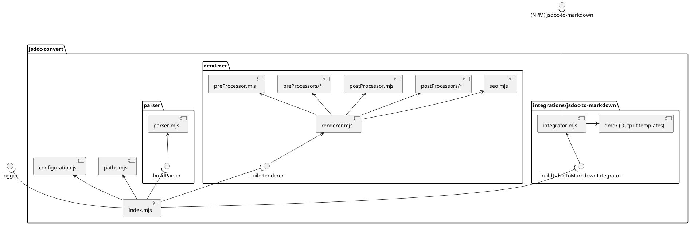
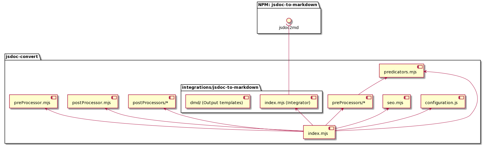

`node index.js` - generates API Reference

All configuration was moved into `configuration.js` file.

```js
module.exports = {
  pathToSource: '../../../../src',
  pathToDist: '../../../next/api',
  urlPrefix: '/next/api/',
  whitelist: [ /* ... */ ], // todo it will be removed.
  seo: {
    'dataMap/metaManager/metaSchema.js': {
      title: 'Options',
      metaTitle: 'Options - API Reference - Handsontable Documentation',
      permalink: '/next/api/options'
    },
    /* ... */
  },
  linkAliases: {
    options: 'metaSchema',
    hooks: 'pluginHooks'
  }
};

```

For customizing a template goes into `./integrations/jsdoc-to-markdown/dmd/partials`. There are all partials from `dmd` package (which render markdown files from parsed jsdoc). To replace a partial, please add prefix `hot-` and find and rename all usages.


## Dependency flow

<details>
<summary>PlantUML code</summary>

[Edit](https://www.planttext.com/?text=ZLH1ReCm4Bpx5HOdKedmWoZNLagBgjvG3Yvs20bWj5xQIbN-NeE160oa1mxip8vtFGDxXGomBdAIbIZWn191FVyrEcpeHN6P12Y3Wi6Lo-_IipcvJ5C17Y4LIwuirHN3JsJv9G0z-aie7R2cCGM6cInLw0gtP4fZNl2G-cyrLZLI54MLCnHgSpHeBo9XMroKATud-gopdByqqX_oq0a_3nsQVDEFFHE8aWlGE_IdLo0Ya8bGoZvXL5RXawbsa5GussBN9prAo3lJbFf99lN9RkyTgrjbsADYeEmjsjTrgQZbD48DRkubriwTihGsBcrDkrR3ip9YfBM0Yn_pUYDawWWDWheA0f_62mawadMNQDE_Svrs3u8iFQEchcH6ppUws5xSjVanh_LmWUPcu1_45S4X82FNUtIS5MBPEPnZ1O1OZhMu_-WxMMWOmhU0TuboKVEVS83TNDvcI7R-zde6_QVw0m00)


</details>


