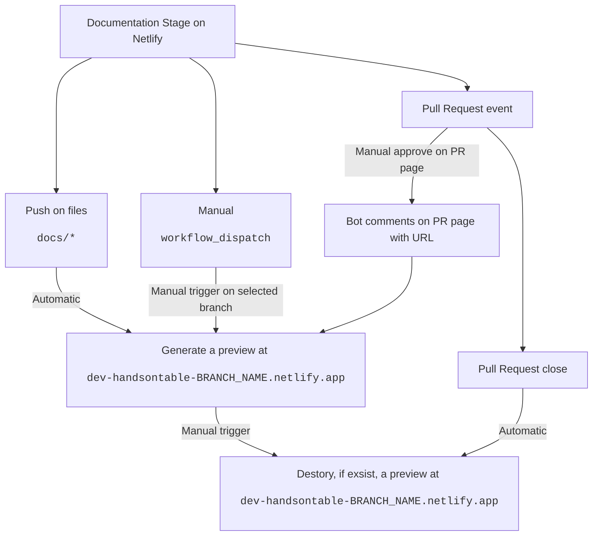

# Documentation deployment guidelines

This page covers guidelines for deploying the [Handsontable documentation](https://handsontable.com/docs).

## About documentation deployment

A [`prod-docs/<MAJOR.MINOR>` branch](./README.md#handsontable-documentation-branches-structure) with the largest version number gets automatically tagged as the documentation's latest version.

Our server configuration watches for images tagged with `:v12.1`, `:v13.0` and so on, and automatically refreshes after detecting a newer version.

### Docker settings

Before generating the documentation, set [Docker's runtime memory limit](https://docs.docker.com/docker-for-mac/).

The recommended runtime memory limit is 8 GB. It allows us to generate 4 documentation versions at a time.

## Deploying the documentation

Handsontable's [GitHub Actions setup](https://github.com/handsontable/handsontable/actions) deploys the documentation based on the following Docker image tags:

| Docker image tag      | Build type | Triggered by                                          | Used for                                                                                                                                   |
| --------------------- | ---------- | ----------------------------------------------------- | ------------------------------------------------------------------------------------------------------------------------------------------ |
| `:v12.1`, `v13.0` etc.         | Production | A push that changes `docs/**` on the Docs production branch e.g `prod-docs/12.1` | Automatic production deployment |
| `:v12.1-[COMMIT_HASH]`, `:v13.0-[COMMIT_HASH]` etc. | Production | A push that changes `docs/**` on the Docs production branch e.g `prod-docs/12.1` | Images used for backups                                                                                                     |

### Deploying the documentation to the staging environment

Staging documentation is being deployed on `netlify` either automatic on manually based on the following diagram. 




#### `workflow_dispatch` manual trigger on any branch
To deploy the documentation to the [staging environment](https://dev.handsontable.com/docs), from GitHub Actions:

1. Go to [github.com/handsontable/handsontable/actions](https://github.com/handsontable/handsontable/actions).
2. Select the **Docs Staging Deployment** workflow.
3. Select the **Run workflow** drop-down.
4. Select the branch that you want to deploy.
5. Select **Run workflow**.

#### Manual trigger on pull request page

On pull request page there will be pipeline in waiting mode that once [approved](https://docs.github.com/en/actions/managing-workflow-runs-and-deployments/managing-deployments/managing-environments-for-deployment#required-reviewers
) will (re)generate a staging version of documentation and bot will send url in PR comment. 

When pull request is closed staged version will be delegated to destroy. 

### Manually deploying the documentation to the production environment

To deploy the documentation to the [production environment](https://handsontable.com/docs), from GitHub Actions:

1. Go to [github.com/handsontable/handsontable/actions](https://github.com/handsontable/handsontable/actions).
2. Select the **Docs Production Deployment** workflow.
3. Select the **Run workflow** drop-down.
4. Select the Docs production branch that you want to deploy (e.g `docs-prod/12.1`).
5. Select **Run workflow**.

To deploy the documentation to the [production environment](https://handsontable.com/docs), from the command line:

1. When deploying for the first time, log in to the GitHub Container Registry (ghcr.io):
    ```bash
    docker login --registry docker.pkg.github.com
    ```
    * Login: Your GitHub account email
    * Password: PAT with the `write:packages` permission: https://github.com/settings/tokens/new

2. Deploy the documentation:
    ```bash
    npm run docs:docker:build:production

    docker push docker.pkg.github.com/handsontable/handsontable/handsontable-documentation:v12.1
    ```

### Reverting a production deployment

To revert a production deployment to a previous version (on the example of a broken version 12.1):

1. Pull a previously-deployed Docker image of your choice, tagged with `[COMMIT_HASH]`:
    ```bash
    docker pull docker.pkg.github.com/handsontable/handsontable/handsontable-documentation:v12.1-[COMMIT_HASH]
    ```
2. Make the `production` Docker tag refer to your `[COMMIT_HASH]` version:
    ```bash
    docker tag docker.pkg.github.com/handsontable/handsontable/handsontable-documentation:v12.1-[COMMIT_HASH] docker.pkg.github.com/handsontable/handsontable/handsontable-documentation:v12.1
    ```
3. Push the `production` Docker image (which is your `[COMMIT_HASH]` version now) back to the registry:
    ```bash
    docker push docker.pkg.github.com/handsontable/handsontable/handsontable-documentation:v12.1
    ```
