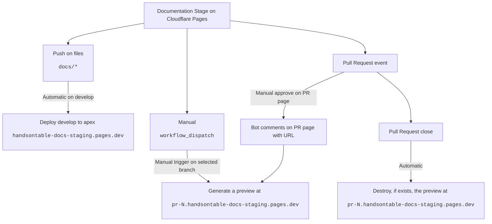

# Documentation deployment guidelines

This page covers guidelines for deploying the [Handsontable documentation](https://handsontable.com/docs).

## About documentation deployment

The documentation is deployed to **Cloudflare Pages**. A [`prod-docs/<MAJOR.MINOR>` branch](./README.md#handsontable-documentation-branches-structure) with the largest version number gets automatically tagged as the documentation's latest version.

The `prod-docs/latest` branch triggers a GitHub workflow that initiates a rebuild and deploys to Cloudflare Pages on each push or when a new `prod-docs/<MAJOR.MINOR>` branch is created.

Two Cloudflare Pages projects back the documentation:

| Project | Apex URL | Serves |
|---|---|---|
| `handsontable-docs` | `handsontable-docs.pages.dev` (custom domain: [handsontable.com/docs](https://handsontable.com/docs)) | Production |
| `handsontable-docs-staging` | `handsontable-docs-staging.pages.dev` | Staging (`develop`) and per-PR previews |

A Cloudflare Pages deployment is served at the apex `<project>.pages.dev` only when its `wrangler --branch` matches the project's production branch label (a stable label, not a git branch). Production uses the label `production`; staging uses `develop`. Per-PR builds deploy to the branch `pr-<N>`, served as an isolated preview at `pr-<N>.handsontable-docs-staging.pages.dev`.

The build scripts that assemble the multi-version documentation site live in the `docs/deploy/` directory. The redirect and rewrite logic is implemented in the Cloudflare Pages worker at `docs/cloudflare/_worker.js`.

## Deploying the documentation

Handsontable's [GitHub Actions setup](https://github.com/handsontable/handsontable/actions) deploys the documentation to Cloudflare Pages.

### Deploying the documentation to the staging environment

Staging documentation is deployed to Cloudflare Pages either automatically or manually based on the following diagram.

```mermaid
flowchart TD
    Docs[Documentation Stage on Cloudflare Pages]
    Push[Push on files <pre>docs/*</pre>]
    Manual[Manual <pre>workflow_dispatch</pre>]
    PullRequest[Pull Request event]
    PullRequestClose[Pull Request close]
    Apex[Deploy develop to apex <pre>handsontable-docs-staging.pages.dev</pre>]
    Preview[Generate a preview at <pre>pr-N.handsontable-docs-staging.pages.dev</pre>]
    Destroy[Destroy, if exists, the preview at <pre>pr-N.handsontable-docs-staging.pages.dev</pre>]
    Push -->|Automatic on develop| Apex
    Manual -->|Manual trigger on selected branch| Preview
    PullRequest --> |Manual approve on PR page| Comment[Bot comments on PR page with URL]  --> Preview
    PullRequestClose --> |Automatic| Destroy
    Docs --> Push
    Docs --> Manual
    Docs --> PullRequest
    PullRequest --> PullRequestClose
```

#### `workflow_dispatch` manual trigger on any branch

To deploy the documentation to the staging environment, from GitHub Actions:

1. Go to [github.com/handsontable/handsontable/actions](https://github.com/handsontable/handsontable/actions).
2. Select the **Docs Staging Deployment** workflow.
3. Select the **Run workflow** drop-down.
4. Select the branch that you want to deploy.
5. Select **Run workflow**.

A push to `develop` (touching `docs/**`) deploys to the staging apex `handsontable-docs-staging.pages.dev`.

#### Manual trigger on pull request page

On the pull request page there will be a pipeline in waiting mode that, once [approved](https://docs.github.com/en/actions/managing-workflow-runs-and-deployments/managing-deployments/managing-environments-for-deployment#required-reviewers), (re)generates a Cloudflare Pages preview of the documentation and posts the `pr-<N>.handsontable-docs-staging.pages.dev` URL in a PR comment.

When the pull request is closed, the preview deployment is deleted.

### Deploying the documentation to the production environment

To deploy the documentation to the [production environment](https://handsontable.com/docs), from GitHub Actions:

1. Go to [github.com/handsontable/handsontable/actions](https://github.com/handsontable/handsontable/actions).
2. Select the **Docs Production Deployment** workflow.
3. Select the **Run workflow** drop-down.
4. Select the Docs production branch that you want to deploy (e.g. `prod-docs/12.1`).
5. Select **Run workflow**.

The workflow assembles the multi-version site (current plus previous versions, pulled from the published GHCR Docker images) using the scripts in `docs/deploy/`, then deploys it to the `handsontable-docs` Cloudflare Pages project on the `production` branch label, which serves it at the apex.

### Reverting a production deployment

To revert a production deployment to a previous version:

1. Go to [github.com/handsontable/handsontable/actions](https://github.com/handsontable/handsontable/actions).
2. Select the **Docs Production Deployment** workflow.
3. Select **Run workflow** on the `prod-docs/<MAJOR.MINOR>` branch with the desired version.
4. Alternatively, revert the commit on the `prod-docs/latest` branch and push - this triggers an automatic rebuild and Cloudflare Pages deployment.

You can also roll back instantly from the Cloudflare dashboard: open the `handsontable-docs` project, find a previous production deployment, and promote it via **Rollback to this deployment**.
