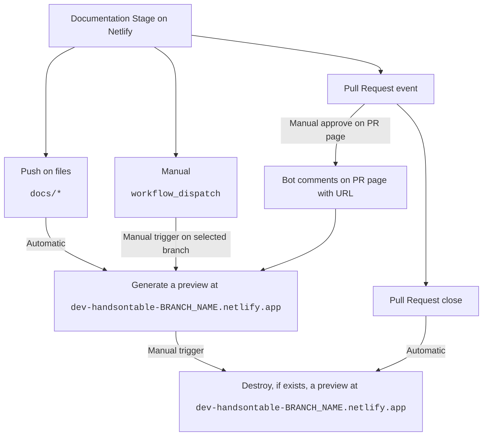

# Documentation deployment guidelines

This page covers guidelines for deploying the [Handsontable documentation](https://handsontable.com/docs).

## About documentation deployment

The documentation is deployed via Netlify. A [`prod-docs/<MAJOR.MINOR>` branch](./README.md#handsontable-documentation-branches-structure) with the largest version number gets automatically tagged as the documentation's latest version.

The `prod-docs/latest` branch triggers a GitHub workflow that initiates a rebuild and deploys to Netlify on each push or when a new `prod-docs/<MAJOR.MINOR>` branch is created.

## Deploying the documentation

Handsontable's [GitHub Actions setup](https://github.com/handsontable/handsontable/actions) deploys the documentation to Netlify.

### Deploying the documentation to the staging environment

Staging documentation is deployed on Netlify either automatically or manually based on the following diagram.

```mermaid
flowchart TD
    Docs[Documentation Stage on Netlify]
    Push[Push on files <pre>docs/*</pre>]
    Manual[Manual <pre>workflow_dispatch</pre>]
    PullRequest[Pull Request event]
    PullRequestClose[Pull Request close]
    Generate[Generate a preview at <pre>dev-handsontable-BRANCH_NAME.netlify.app</pre>]
    Destory[Destroy, if exists, a preview at <pre>dev-handsontable-BRANCH_NAME.netlify.app</pre>]
    Push -->|Automatic| Generate
    Manual -->|Manual trigger on selected branch| Generate
    PullRequest --> |Manual approve on PR page| Comment[Bot comments on PR page with URL]  --> Generate
    PullRequestClose --> |Automatic| Destory
    Generate -->|Manual trigger| Destory
    Docs --> Push
    Docs --> Manual
    Docs --> PullRequest
    PullRequest --> PullRequestClose
```

#### `workflow_dispatch` manual trigger on any branch
To deploy the documentation to the [staging environment](https://dev.handsontable.com/docs), from GitHub Actions:

1. Go to [github.com/handsontable/handsontable/actions](https://github.com/handsontable/handsontable/actions).
2. Select the **Docs Staging Deployment** workflow.
3. Select the **Run workflow** drop-down.
4. Select the branch that you want to deploy.
5. Select **Run workflow**.

#### Manual trigger on pull request page

On pull request page there will be pipeline in waiting mode that once [approved](https://docs.github.com/en/actions/managing-workflow-runs-and-deployments/managing-deployments/managing-environments-for-deployment#required-reviewers
) will (re)generate a staging version of documentation and bot will send url in PR comment.

When pull request is closed staged version will be delegated to destroy.

### Deploying the documentation to the production environment

To deploy the documentation to the [production environment](https://handsontable.com/docs), from GitHub Actions:

1. Go to [github.com/handsontable/handsontable/actions](https://github.com/handsontable/handsontable/actions).
2. Select the **Docs Production Deployment** workflow.
3. Select the **Run workflow** drop-down.
4. Select the Docs production branch that you want to deploy (e.g `prod-docs/12.1`).
5. Select **Run workflow**.

The deployment is handled entirely through Netlify. The `netlify/` directory in the `docs/` folder contains the Netlify configuration and build scripts used by the CI/CD pipeline.

### Reverting a production deployment

To revert a production deployment to a previous version:

1. Go to [github.com/handsontable/handsontable/actions](https://github.com/handsontable/handsontable/actions).
2. Select the **Docs Production Deployment** workflow.
3. Select **Run workflow** on the `prod-docs/<MAJOR.MINOR>` branch with the desired version.
4. Alternatively, revert the commit on the `prod-docs/latest` branch and push - this will trigger an automatic Netlify rebuild.
