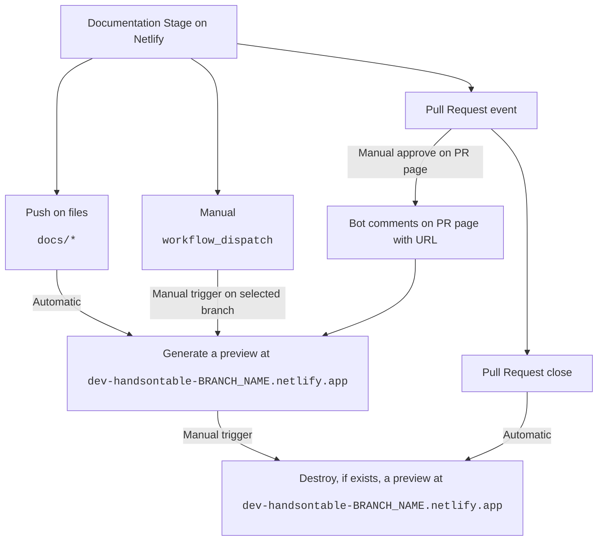

# Documentation deployment guidelines

This page covers guidelines for deploying the [Handsontable documentation](https://handsontable.com/docs).

## About documentation deployment

The documentation is deployed via **Cloudflare Pages**. A [`prod-docs/<MAJOR.MINOR>` branch](./README.md#handsontable-documentation-branches-structure) with the largest version number gets automatically tagged as the documentation's latest version.

The `prod-docs/latest` branch triggers a GitHub workflow that initiates a rebuild and deploys to Cloudflare on each push or when a new `prod-docs/<MAJOR.MINOR>` branch is created.

### Deployment platforms (current state)

| Environment | Platform |
|---|---|
| **Production** (`handsontable.com/docs`) | Cloudflare Pages |
| **Staging** (`dev.handsontable.com/docs`) | Cloudflare Pages |
| **Pull request previews** | Cloudflare Pages **and** Netlify (both generated, transitional) |

Netlify no longer serves production - it remains active only for PR previews during the migration to Cloudflare. The `netlify/` and `cloudflare/` directories under `docs/` hold each platform's configuration and build scripts.

> **Redirects must be kept in sync across both platforms.** See the [Redirects](#redirects) section below before editing any redirect rule.

## Deploying the documentation

Handsontable's [GitHub Actions setup](https://github.com/handsontable/handsontable/actions) deploys the documentation to Netlify.

### Deploying the documentation to the staging environment

Staging documentation is deployed on Netlify either automatically or manually based on the following diagram.

```mermaid
flowchart TD
    Docs[Documentation Stage on Netlify]
    Push[Push on files <pre>docs/*</pre>]
    Manual[Manual <pre>workflow_dispatch</pre>]
    PullRequest[Pull Request event]
    PullRequestClose[Pull Request close]
    Generate[Generate a preview at <pre>dev-handsontable-BRANCH_NAME.netlify.app</pre>]
    Destory[Destroy, if exists, a preview at <pre>dev-handsontable-BRANCH_NAME.netlify.app</pre>]
    Push -->|Automatic| Generate
    Manual -->|Manual trigger on selected branch| Generate
    PullRequest --> |Manual approve on PR page| Comment[Bot comments on PR page with URL]  --> Generate
    PullRequestClose --> |Automatic| Destory
    Generate -->|Manual trigger| Destory
    Docs --> Push
    Docs --> Manual
    Docs --> PullRequest
    PullRequest --> PullRequestClose
```

#### `workflow_dispatch` manual trigger on any branch
To deploy the documentation to the [staging environment](https://dev.handsontable.com/docs), from GitHub Actions:

1. Go to [github.com/handsontable/handsontable/actions](https://github.com/handsontable/handsontable/actions).
2. Select the **Docs Staging Deployment** workflow.
3. Select the **Run workflow** drop-down.
4. Select the branch that you want to deploy.
5. Select **Run workflow**.

#### Manual trigger on pull request page

On pull request page there will be pipeline in waiting mode that once [approved](https://docs.github.com/en/actions/managing-workflow-runs-and-deployments/managing-deployments/managing-environments-for-deployment#required-reviewers
) will (re)generate a staging version of documentation and bot will send url in PR comment.

When pull request is closed staged version will be delegated to destroy.

### Deploying the documentation to the production environment

To deploy the documentation to the [production environment](https://handsontable.com/docs), from GitHub Actions:

1. Go to [github.com/handsontable/handsontable/actions](https://github.com/handsontable/handsontable/actions).
2. Select the **Docs Production Deployment** workflow.
3. Select the **Run workflow** drop-down.
4. Select the Docs production branch that you want to deploy (e.g `prod-docs/12.1`).
5. Select **Run workflow**.

Production is served by Cloudflare Pages. The `cloudflare/` directory in the `docs/` folder contains the Cloudflare Pages worker and deployment scripts used by the CI/CD pipeline.

### Reverting a production deployment

To revert a production deployment to a previous version:

1. Go to [github.com/handsontable/handsontable/actions](https://github.com/handsontable/handsontable/actions).
2. Select the **Docs Production Deployment** workflow.
3. Select **Run workflow** on the `prod-docs/<MAJOR.MINOR>` branch with the desired version.
4. Alternatively, revert the commit on the `prod-docs/latest` branch and push - this will trigger an automatic Cloudflare rebuild.

## Redirects

Redirect rules are implemented in **two places that must be kept in sync**:

- `cloudflare/_worker.js` - the **production and staging** authority. When a `_worker.js` is present, Cloudflare Pages ignores `_redirects` entirely, so this worker re-implements all redirect logic (the `netlify/_redirects` rules plus the `netlify/` edge functions). It is **hand-maintained** - there is no generator.
- `netlify/_redirects` (plus `netlify/netlify/edge-functions/`) - used for Netlify PR previews.

When you add, change, or remove a redirect (for example, after renaming a page's `permalink`), update **both** files. For a page rename, add the old-slug-to-new-slug rule for all four framework prefixes (`javascript-/react-/angular-/vue-data-grid`):

- In `cloudflare/_worker.js`, add exact-path entries to the `crossFramework` map (it is matched before the static-asset fallthrough).
- In `netlify/_redirects`, add the equivalent per-prefix lines. Do **not** point a `:major.:minor` versioned wildcard at the new slug - that wildcard matches every frozen older version where the page still lives at the old slug.

`docker/redirects-autogenerated.conf` is generated at build (`# DO NOT EDIT`); it only normalizes `/docs/next/...` to `/docs/...` and does not handle same-version renames. `docker/redirects.conf` is reserved for ancient slug families and does not serve production.

### Latest-version redirect (`/docs/<latest>/* → /docs/*`)

The latest version's docs are also served at the unversioned `/docs/...` root, so the versioned URLs (for example, `/docs/18.0/angular-data-grid`) are duplicates of the unversioned canonical (`/docs/angular-data-grid`). Both platforms redirect the versioned form to the unversioned one:

- **Netlify** appends `/docs/$LATEST_VERSION/* /docs/:splat 301` to `_redirects` at build time (`netlify/build_current_version.sh`), where `LATEST_VERSION` comes from `netlify/getListOrPreviousVersions.mjs`.
- **Cloudflare** carries the same rule inside `cloudflare/_worker.js` (rule 1b). The worker is static, so the `__LATEST_DOCS_VERSION__` placeholder in its `LATEST_VERSION` constant is substituted at deploy time by the "Add Cloudflare worker to production deploy" step in `docs-production.yml`, using the same `getListOrPreviousVersions.mjs` source. If the placeholder is left unreplaced (for example, on staging previews, which have no versioned docs), the worker's `\d+\.\d+` guard makes the rule a no-op.

This redirect is **not** a page rename, so it does not need a `crossFramework` entry - it strips the latest-version prefix from any path.
