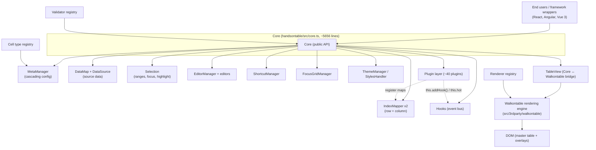
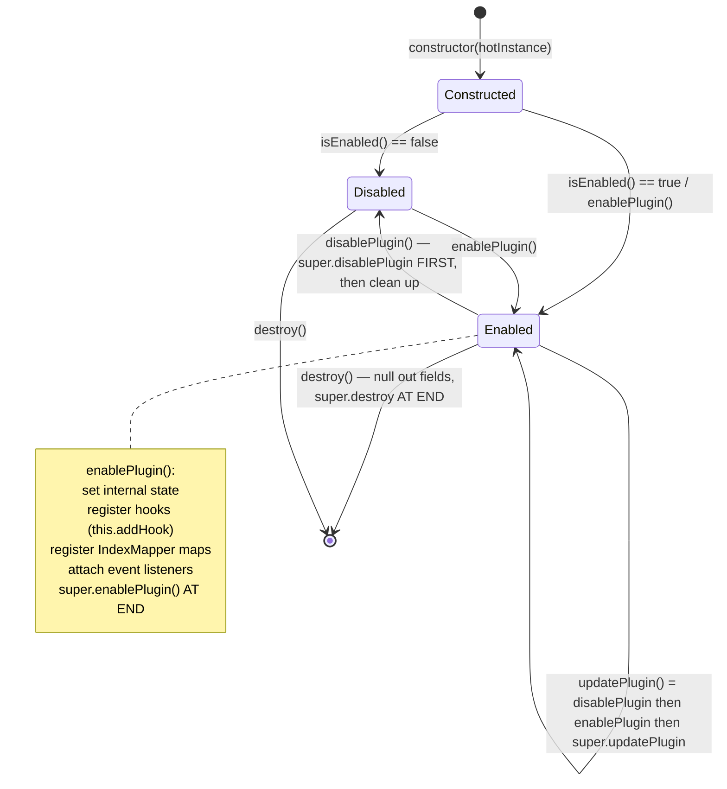
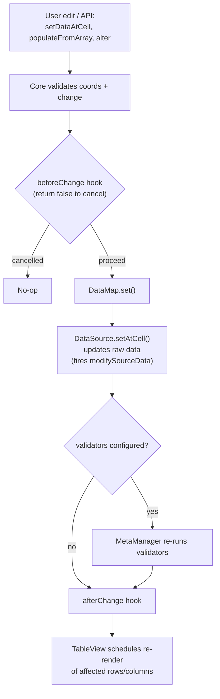
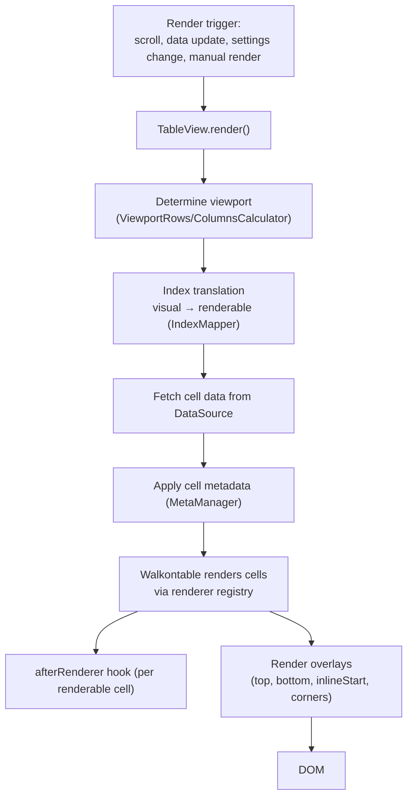
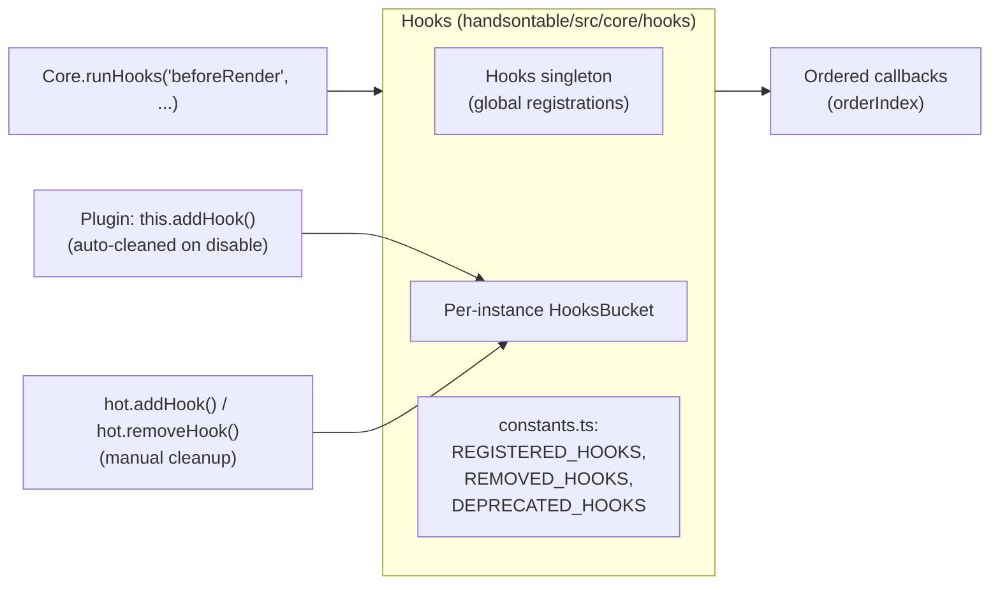
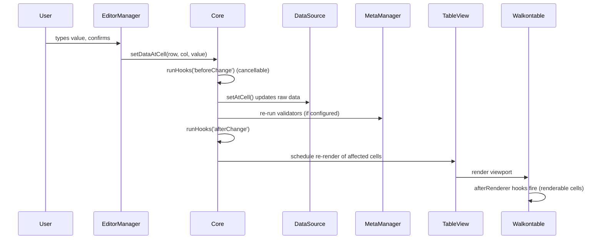

# Architecture

## Pattern Overview

**Overall:** Microkernel with plugin system and layered rendering engine

**Key Characteristics:**
- Constructor-function-based Core class (`Core`) that exposes the entire public API as instance methods
- Plugin system where all features extend `BasePlugin` and hook into the core via an event/hook bus
- Separate rendering engine (Walkontable) embedded as a "3rd party" module, bridged through `TableView`
- Three coordinate systems (physical, visual, renderable) managed by `IndexMapper`
- Cascading metadata system (GlobalMeta -> TableMeta -> ColumnMeta -> CellMeta) for configuration
- Registry pattern for all extensible components (plugins, editors, renderers, validators, cell types, themes)
- Two entry points: `base.ts` (tree-shakeable, minimal) and `index.ts` (full, registers everything)

## Layers

**Public API (Core):**
- Purpose: Exposes all grid methods (getData, setData, selectCell, updateSettings, etc.)
- Location: `handsontable/src/core.ts` (~5656 lines)
- Contains: The `Core` constructor function with all public API methods defined on `this`
- Depends on: Every subsystem (Selection, DataMap, MetaManager, IndexMapper, TableView, EditorManager, Hooks, ShortcutManager, FocusManager, ThemeManager)
- Used by: Framework wrappers (React, Angular, Vue), end users

**View Layer (TableView + Walkontable):**
- Purpose: Bridges Core to the DOM rendering engine (Walkontable)
- Location: `handsontable/src/tableView.ts` (TableView), `handsontable/src/3rdparty/walkontable/src/` (Walkontable, TypeScript with its own separate build/test pipeline)
- Contains: DOM element creation, event delegation (mouse/touch/keyboard), scroll handling, overlay management
- Depends on: Walkontable engine, Core instance for data callbacks
- Used by: Core (via `this.view`)

**Walkontable Rendering Engine:**
- Purpose: Low-level table rendering, viewport calculation, scroll synchronization, overlays for frozen rows/columns
- Location: `handsontable/src/3rdparty/walkontable/src/`
- Contains: Table renderers (`renderer/`), overlay managers (`overlay/`), viewport calculators (`calculator/`), cell/range coordinate primitives (`cell/`), scroll logic (`scroll.ts`), selection rendering (`selection/`)
- Depends on: Settings object provided by TableView, DOM APIs
- Used by: TableView exclusively (via Facade pattern in `facade/core.ts`)
- Key submodules:
  - `core/_base.ts`, `core/core.ts`, `core/clone.ts` - Walkontable core and clone instances
  - `table/master.ts` - Master table, `table/top.ts`, `table/bottom.ts`, etc. - Overlay tables
  - `overlay/` - 6 overlay types (top, bottom, inlineStart, topInlineStartCorner, bottomInlineStartCorner, plus base)
  - `calculator/` - Viewport row/column calculators
  - `renderer/` - Low-level cell/row/colgroup/header renderers
  - `scroll.ts` - Scroll position management
  - `viewport.ts` - Viewport state

**Data Layer (DataMap + DataSource):**
- Purpose: Manages source data, data transformations, and the mapping between data and grid cells
- Location: `handsontable/src/dataMap/`
- Contains: `DataMap` (row/column data access), `DataSource` (raw data wrapper), `replaceData` (data replacement logic), `sourceDataValidator` (validation)
- Depends on: MetaManager for cell metadata
- Used by: Core (via `datamap` and `dataSource` internal variables)

**Metadata Layer (MetaManager):**
- Purpose: Cascading configuration system - GlobalMeta -> TableMeta -> ColumnMeta -> CellMeta
- Location: `handsontable/src/dataMap/metaManager/`
- Contains: Four meta layers (`metaLayers/globalMeta.ts`, `tableMeta.ts`, `columnMeta.ts`, `cellMeta.ts`), meta schema (`metaSchema.ts`), modifier mods (`mods/`)
- Depends on: Helpers
- Used by: Core, plugins (via `hot.getCellMeta()`, `hot.getSettings()`)
- Pattern: Prototype chain inheritance. GlobalMeta is the prototype of ColumnMeta, which is the prototype of CellMeta. TableMeta is a direct instance of GlobalMeta. This allows cascading: cell-level settings override column-level, which override table-level, which override global defaults.

**Index Translation Layer:**
- Purpose: Manages the three coordinate systems (physical, visual, renderable) and index maps (hiding, trimming)
- Location: `handsontable/src/translations/`
- Contains: `IndexMapper` (main class), `maps/` (HidingMap, TrimmingMap, IndexesSequence, PhysicalIndexToValueMap, LinkedPhysicalIndexToValueMap), `mapCollections/` (AggregatedCollection, MapCollection), `changesObservable/`
- Depends on: Helpers, mixins
- Used by: Core (`hot.rowIndexMapper`, `hot.columnIndexMapper`), plugins that modify row/column visibility

**Selection Layer:**
- Purpose: Manages cell/range selection, multi-selection, focus, and selection transformations
- Location: `handsontable/src/selection/`
- Contains: `Selection` class (`selection.ts`), `SelectionRange` (`range.ts`), `Highlight` system (`highlight/`), transformation modules (`transformation/`), mouse event handler (`mouseEventHandler.ts`), utilities (`utils.ts`)
- Depends on: IndexMapper (for coordinate translation), Walkontable Selection (for rendering highlights)
- Used by: Core (via `selection` internal variable), EditorManager, plugins

**Plugin System:**
- Purpose: All grid features are implemented as plugins that extend `BasePlugin`
- Location: `handsontable/src/plugins/`
- Contains: 40+ plugins, each in its own directory with an `index.ts` barrel export
- Depends on: Core (via `this.hot`), Hooks system, IndexMapper
- Used by: Core instantiates all registered plugins
- Key plugins: `autoColumnSize`, `autoRowSize`, `columnSorting`, `dataProvider`, `filters`, `formulas`, `hiddenColumns`, `hiddenRows`, `mergeCells`, `nestedHeaders`, `nestedRows`, `notification`, `undoRedo`, `contextMenu`, `copyPaste`, `comments`, `stretchColumns`
- **DataProvider and error UI:** With a complete `dataProvider` configuration, failed `fetchRows` or `onRowsCreate` / `onRowsUpdate` / `onRowsRemove` (including refetch after a mutation) can show a built-in **error toast** when the **Notification** plugin is enabled (`notification: true` or a config object). **Fetch** failures add a **Refetch** action that calls `fetchData()` again (toast uses `duration: 0` until dismissed or Refetch). The **Dialog** plugin is not used for those errors; Dialog remains for blocking overlays (for example Loading plugin, ExportFile binary export progress, and custom modal content).

**Hooks System:**
- Purpose: Event bus for inter-component communication (before/after patterns)
- Location: `handsontable/src/core/hooks/`
- Contains: `Hooks` class (singleton), `HooksBucket`, hook constants (`constants.ts` with REGISTERED_HOOKS, REMOVED_HOOKS, DEPRECATED_HOOKS)
- Depends on: Helpers
- Used by: Core, all plugins, EditorManager, Selection
- Pattern: Global singleton + per-instance buckets. Hooks can be added globally or per-instance. Plugins use `this.addHook()` (auto-cleaned on disable) vs `this.hot.addHook()` (manual cleanup).

**Editor System:**
- Purpose: Manages cell editors (text input, dropdown, date picker, etc.)
- Location: `handsontable/src/editors/`, `handsontable/src/editorManager.ts`
- Contains: `EditorManager` (orchestrates editor lifecycle), `BaseEditor` (abstract base), 15+ editor types
- Depends on: Selection (to know which cell is active), MetaManager (for cell type config)
- Used by: Core

**Renderer System:**
- Purpose: Cell rendering functions that produce HTML content for cells
- Location: `handsontable/src/renderers/`
- Contains: `baseRenderer`, `textRenderer`, `numericRenderer`, `checkboxRenderer`, `htmlRenderer`, etc.
- Depends on: MetaManager (for cell configuration)
- Used by: Walkontable (calls renderer functions during table render)

**Validator System:**
- Purpose: Cell value validation
- Location: `handsontable/src/validators/`
- Contains: `autocompleteValidator`, `dateValidator`, `numericValidator`, `timeValidator`, etc.
- Used by: Core (triggered on data changes)

**Cell Type System:**
- Purpose: Bundles an editor + renderer + validator into a named cell type
- Location: `handsontable/src/cellTypes/`
- Contains: Composite types like `textType`, `numericType`, `checkboxType`, `dateType`, `dropdownType`, etc.
- Used by: MetaManager (resolves cell type to editor/renderer/validator)

**Shortcut System:**
- Purpose: Keyboard shortcut management with context-based scoping
- Location: `handsontable/src/shortcuts/` (manager, recorder, context), `handsontable/src/shortcutContexts/` (predefined contexts)
- Used by: Core, plugins

**Focus Management:**
- Purpose: Manages browser focus and focus scoping for accessibility
- Location: `handsontable/src/focusManager/`
- Contains: `FocusGridManager`, scope manager, predefined scopes
- Used by: Core

**Theme System:**
- Purpose: CSS theme management with CSS variables
- Location: `handsontable/src/themes/` (engine, registry, static themes), `handsontable/src/styles/` (SCSS sources)
- Contains: Theme engine (`engine/`), theme registry (`registry.ts`), static theme definitions (`static/`), theme class (`theme/`)
- Used by: Core (via `stylesHandler` and `themeManager`)

## Data Flow

**Initialization Flow:**

1. User calls `new Handsontable(element, settings)` which calls `base.ts` -> `Core(element, settings, rootInstanceSymbol)`
2. Core creates: `MetaManager`, `IndexMapper` (row + column), `DataSource`, `Selection`, `EditorManager`, `ShortcutManager`, `FocusGridManager`, `StylesHandler`, `ThemeManager`
3. Core creates `TableView` which creates `Walkontable` instance
4. All registered plugins are instantiated (each calls `constructor(hotInstance)`)
5. `afterPluginsInitialized` hook fires, each plugin's `isEnabled()` is checked, and `enablePlugin()` called if true
6. `init()` triggers initial data load and render

**Render Flow:**

1. Core calls `this.view.render()` (or plugin triggers render via hooks)
2. `TableView` delegates to Walkontable's `draw()` method
3. Walkontable calculates visible viewport using `ViewportRowsCalculator` and `ViewportColumnsCalculator`
4. Walkontable iterates visible rows/columns, calls renderer functions from the renderer registry for each cell
5. Each overlay (top frozen, left frozen, corner) renders its own clone table synchronized with the master table
6. Selection highlights are rendered via Walkontable's `Selection` rendering system

**Data Change Flow:**

1. User edits a cell or calls `setDataAtCell(row, col, value)`
2. Core fires `beforeChange` hook (plugins can modify/cancel)
3. `DataMap.set()` updates the source data
4. Core fires `afterChange` hook
5. If validation is configured, `validateCells()` runs validators
6. `render()` is called to update the DOM

**Settings Update Flow:**

1. User calls `updateSettings(newSettings)`
2. Core fires `beforeUpdateSettings` hook
3. `MetaManager` updates cascading meta layers
4. Each plugin's `onUpdateSettings()` is called; if the changed key is in `SETTING_KEYS`, `updatePlugin()` runs
5. Core fires `afterUpdateSettings` hook
6. Re-render

**Coordinate Translation Flow:**

1. User provides visual coordinates (e.g., `selectCell(2, 3)`)
2. Core uses `rowIndexMapper.getRenderableFromVisualIndex()` to get renderable index for DOM operations
3. Core uses `rowIndexMapper.getPhysicalFromVisualIndex()` to get physical index for data operations
4. Plugins like `hiddenRows`/`hiddenColumns` register `HidingMap` instances that affect visual-to-renderable translation
5. Plugins like `trimRows` register `TrimmingMap` instances that affect physical-to-visual translation

**State Management:**
- Source data: Held in `DataSource` (reference to user's array/object)
- Cell metadata: Cascading prototype chain in `MetaManager`
- Index state: `IndexMapper` with registered `HidingMap`/`TrimmingMap` instances per plugin
- Selection state: `Selection` class with `SelectionRange` tracking visual coordinates
- Plugin state: Each plugin manages its own internal state

## Key Abstractions

**CellCoords / CellRange:**
- Purpose: Coordinate and range primitives used throughout the codebase
- Examples: `handsontable/src/3rdparty/walkontable/src/cell/coords.ts`, `handsontable/src/3rdparty/walkontable/src/cell/range.ts`
- Pattern: Value objects with methods like `isEqual()`, `includes()`, `getTopStartCorner()`, etc.

**IndexMapper:**
- Purpose: Single source of truth for row/column index translations between physical, visual, and renderable coordinate systems
- Examples: `handsontable/src/translations/indexMapper.ts`
- Pattern: Maintains collections of maps (trimming, hiding, value) and caches translations. Plugins register named maps.

**BasePlugin:**
- Purpose: Abstract base for all plugin implementations with standardized lifecycle
- Examples: `handsontable/src/plugins/base/base.ts`
- Pattern: Template method pattern with `isEnabled()` -> `enablePlugin()` -> `updatePlugin()` -> `disablePlugin()` -> `destroy()`

**Hooks (Event Bus):**
- Purpose: Decoupled communication between Core, plugins, and user code
- Examples: `handsontable/src/core/hooks/index.ts`
- Pattern: Observer/pub-sub with global singleton and per-instance buckets. Supports ordered callbacks via `orderIndex`.

**MetaManager (Cascading Config):**
- Purpose: Configuration inheritance chain from global defaults to individual cell settings
- Examples: `handsontable/src/dataMap/metaManager/index.ts`
- Pattern: Prototype-chain inheritance: GlobalMeta (prototype) -> ColumnMeta (prototype) -> CellMeta (instance). TableMeta is a separate instance of GlobalMeta.

**Registry Pattern:**
- Purpose: Dynamic registration and lookup of components by string key
- Examples: `handsontable/src/plugins/registry.ts`, `handsontable/src/editors/registry.ts`, `handsontable/src/renderers/registry.ts`, `handsontable/src/validators/registry.ts`, `handsontable/src/cellTypes/registry.ts`, `handsontable/src/themes/registry.ts`
- Pattern: Map-based registries with `register()` / `get()` / `getNames()` methods. The `registry.ts` module in `src/` aggregates all `registerAll*()` calls.

## Entry Points

**Full Entry (`index.ts`):**
- Location: `handsontable/src/index.ts`
- Triggers: `registerAllModules()` which registers all editors, renderers, validators, cell types, and plugins
- Responsibilities: Creates the full Handsontable namespace with all modules pre-registered. Used for UMD/CDN builds.

**Base Entry (`base.ts`):**
- Location: `handsontable/src/base.ts`
- Triggers: Registers only `TextCellType` and `baseRenderer` (minimal defaults)
- Responsibilities: Tree-shakeable entry point. Users import and register only needed modules.

**Core Constructor:**
- Location: `handsontable/src/core.ts` (exported as `Core`)
- Triggers: Called by `Handsontable()` wrapper in `base.ts`
- Responsibilities: Instantiates all subsystems, creates DOM structure, sets up hooks

## Error Handling

**Strategy:** Custom error helper with cause tracking

**Patterns:**
- Use `throwWithCause(message, cause)` from `handsontable/src/helpers/errors.ts` instead of `throw new Error()`. Enforced by ESLint rule `handsontable/no-native-error-throw`.
- Hooks use before/after pattern where `before*` hooks can return `false` to cancel operations
- Validators use callback pattern (async-capable): `validator(value, callback)` where `callback(true/false)` signals validity
- Console warnings use helpers from `handsontable/src/helpers/console.ts` (never raw `console`)

## Cross-Cutting Concerns

**Logging:** Via `handsontable/src/helpers/console.ts` helpers (`warn`, `log`, `error`). Raw `console` is banned by ESLint.

**Validation:** Cell validators in `handsontable/src/validators/`. Source data validators in `handsontable/src/dataMap/sourceDataValidator.ts`. Triggered on data changes and via `validateCells()` API.

**Authentication:** Not applicable (frontend-only library, no auth).

**Internationalization:** `handsontable/src/i18n/` with language dictionaries and a registry. RTL layout support via `layoutDirection` setting and `isRtl()`/`isLtr()` Core methods.

**Accessibility:** ARIA attributes applied via helpers in `handsontable/src/helpers/a11y.ts`. Announcer utility in `handsontable/src/utils/a11yAnnouncer.ts`. Focus management in `handsontable/src/focusManager/`. Two navigation modes: spreadsheet mode and data grid mode.

**DOM Abstraction:** All DOM access goes through `handsontable/src/helpers/dom/element.ts` and `handsontable/src/helpers/dom/event.ts`. Global `window`/`document` are banned; use `this.hot.rootWindow`/`this.hot.rootDocument`.

**Event Management:** `handsontable/src/eventManager.ts` provides centralized DOM event listener management with automatic cleanup.

## Architecture diagrams

These diagrams summarize the relationships described above. They are a visual companion to the prose — the prose remains authoritative on any detail.

### Core / microkernel architecture

The `Core` constructor is the microkernel. It owns every subsystem and exposes the public API. All features attach as plugins through the hook bus; the DOM is reached only through `TableView` → Walkontable.

System context (concept → code entity mapping): grid concepts that users reason about map to specific code entities. Data cells, columns, rows, selections, and edits are realized by `Core`, `DataSource`, `MetaManager`, `TableView`, and the plugin layer. The rendering engine is Walkontable (virtualized rendering, overlays). Extensions are the 40+ built-in plugins plus custom plugins.

Key design principles: separation of concerns (data, rendering, interaction, and extensions are distinct layers); extensibility via plugins; virtualization (only visible cells render); three-tier indexing (physical/visual/renderable); metadata inheritance (global → table → column → cell); and a synchronous, cancellable hook system.

### Plugin system and lifecycle

`BasePlugin` is the superclass for every plugin. The registry instantiates plugins in `PLUGIN_PRIORITY` order; each plugin coordinates with the rest of the system only through the hook bus and through IndexMapper maps — never via direct cross-plugin imports.

Lifecycle stages in detail: (1) **Instantiation** — the plugin receives the Handsontable instance but is not yet enabled. (2) **`isEnabled()`** — checks `this.hot.getSettings()[PLUGIN_KEY]`. (3) **Enabling** — guards against double-enable, sets internal state, registers hooks, attaches listeners, then calls `super.enablePlugin()`. (4) **Updating** — usually disables then re-enables to apply new config; some plugins implement optimized update logic. (5) **Disabling** — removes listeners and state, calls `super.disablePlugin()` (which clears the EventManager and the plugin's hooks). (6) **Destruction** — final cleanup; hooks are removed automatically and references are nulled for garbage collection.

`PluginManager` responsibilities: registration and instantiation, lifecycle and priority ordering, and conflict-free coordination between plugins. Plugins integrate exclusively through the hook system, executing code at designated extension points.

Built-in plugins (~40) group roughly into: **state-transformation** plugins that modify index mapping (`ColumnSorting`, `MultiColumnSorting`, `Filters`, `HiddenRows`, `HiddenColumns`, `TrimRows`, `ManualRowMove`, `ManualColumnMove`); **auto-sizing** (`AutoRowSize`, `AutoColumnSize`, `StretchColumns`); **data-enhancement** (`Formulas`, `ColumnSummary`, `MergeCells`); **UI-enhancement** (`ContextMenu`, `DropdownMenu`, `CopyPaste`, `Comments`, `MultipleSelectionHandles`, `Dialog`, `Notification`, `TouchScroll`, `DragToScroll`); and the rest (`UndoRedo`, `Search`, `Pagination`, `BindRowsWithHeaders`, `CustomBorders`, `ExportFile`, `Autofill`, `NestedHeaders`, `NestedRows`, `ManualColumnFreeze`, `ManualColumnResize`, `ManualRowResize`, `EmptyDataState`, `Loading`, `CollapsibleColumns`). See `handsontable/.ai/STRUCTURE.md` for the full directory inventory.

### Data-binding and modification flow

`DataSource` wraps the user's original array (array-of-arrays or array-of-objects). It returns shallow clones for safe reads, prevents prototype pollution, and supports the `modifyRowData` / `modifySourceData` hooks for dynamic transformations. Source data stays stable; visual data reflects sorting, filtering, trimming, and hiding.

`loadData(data)` versus `updateData(data)`: `loadData` replaces the entire dataset (clears old data, resets indexes, triggers a full re-render); `updateData` performs a selective update that preserves structure and is more efficient. `DataSource` exposes `getData()`, `getAtRow()`, `getAtCell()`, and `getAtColumn()` for reads, and `setAtCell()` (with validation) for writes.

### Rendering pipeline overview

`TableView` coordinates between Core and Walkontable. Walkontable renders only the cells in the viewport (plus a small buffer), reuses cell DOM nodes, and renders frozen rows/columns as synchronized overlay clones. This is a high-level overview — the detailed rendering-engine architecture lives in `handsontable/src/3rdparty/walkontable/.ai/ARCHITECTURE.md`.

Virtualization behavior: only visible cells plus a small buffer render; hidden rows/columns are excluded from renderable indexes and have size zero in layout; `getColWidth()` returns `0` for hidden columns; and `beforeRenderer` / `afterRenderer` fire only for renderable cells. Rendering is controlled through `batch()`, `suspendRender()`, and `resumeRender()`.

### Hook / event system

The `Hooks` singleton is the internal event bus. Unlike DOM events, hooks are usually synchronous and cancellable. Global registrations live on the singleton; per-instance registrations live in a per-instance `HooksBucket`.

Hook taxonomy:

- **Before hooks** (for example `beforeChange`, `beforeRender`, `beforeSelection`) run before an action and can return `false` to cancel it.
- **After hooks** (for example `afterChange`, `afterRender`, `afterSelection`) run after an action and are informational.
- **Modify hooks** (for example `modifyRowData`, `modifySourceData`) intercept and transform data in flight.

Registration and execution APIs: `hot.addHook(name, callback)` and `hot.removeHook(name, callback)` manage subscriptions; Core dispatches with `this.runHooks(name, ...args)`. Common hook groups span grid lifecycle (`beforeInit`/`afterInit`, `beforeDestroy`/`afterDestroy`), data modification (`beforeChange`/`afterChange`, `beforeCreateRow`/`afterCreateRow`, `beforeRemoveRow`/`afterRemoveRow`), rendering (`beforeRender`/`afterRender`, `beforeRenderer`/`afterRenderer`, `afterGetCellMeta`), selection (`beforeSelection`/`afterSelection`), and settings (`afterUpdateSettings`).

### End-to-end example: cell edit

The path a single cell edit takes, tying the layers together:

