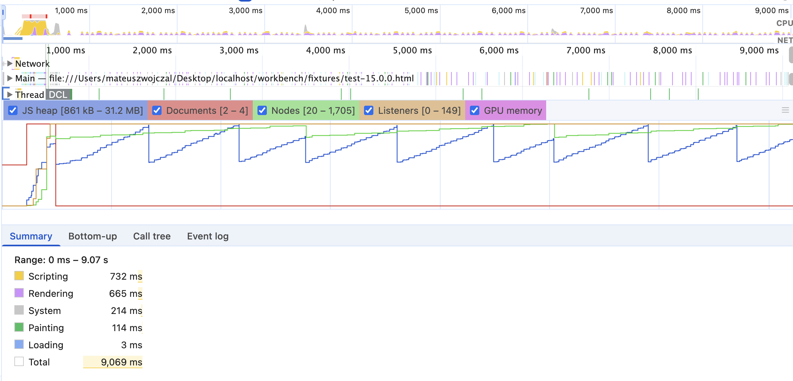
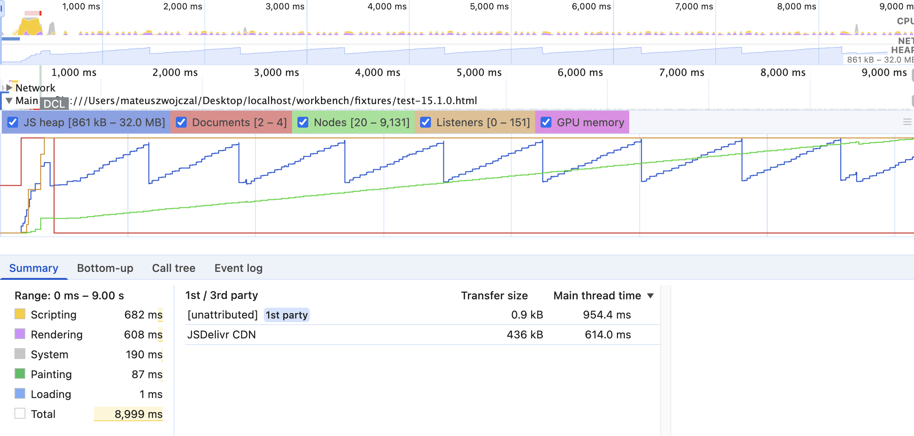

# Handsontable performance comparison

This project benchmarks **two npm versions of Handsontable** under the same Playwright scenario (scroll stress on a grid). Chrome performance traces are recorded during each run; after all tests finish, a **global teardown** script aggregates those traces and writes a **Markdown comparison** to `output/result.md`.

## Prerequisites

- Node.js
- Playwright browsers: `npx playwright install` (if not already installed)

## How to run

```bash
VERSION_1=0.0.0-next-b032e34-20260319 VERSION_2=17.0.0 ITERATIONS=3 npx playwright test
```

### Environment variables

| Variable     | Meaning |
|-------------|---------|
| **`VERSION_1`** | **Baseline** Handsontable version string (npm tag or exact version). Used to load that release from the CDN in the generated fixture and to name trace files (`output/test-{version}-{iteration}.json`). The teardown report treats **the first version as baseline** when computing percent and absolute deltas. |
| **`VERSION_2`** | **Comparison** Handsontable version—the build you want to compare against `VERSION_1`. Same fixture/trace naming rules as `VERSION_1`. |
| **`ITERATIONS`** | How many times **each** version is run. Default in code is **3** if unset. Traces are written as `test-{version}-1.json` … `test-{version}-{ITERATIONS}.json`. The teardown step **averages** metrics across those files per version (arithmetic mean), then compares the two averaged results. |

If you omit these variables, the tests fall back to `VERSION_1=15.0.0`, `VERSION_2=15.1.0`, and `ITERATIONS=3` (see `tests/scroll-down.spec.ts` and `tests/teardown.mjs`).

## What happens when you run the suite

1. **Tests** (`tests/scroll-down.spec.ts`): For each version and iteration, a fixture HTML is built from `tests/template.html` (Handsontable loaded at the chosen version). Playwright opens the page, starts **Chrome DevTools Protocol** tracing (`Tracing.start` with timeline and CPU profiler categories), performs repeated wheel scrolling on the table holder, stops tracing, and saves the JSON trace to `output/test-{version}-{iteration}.json`.

2. **Teardown** (`tests/teardown.mjs`, configured as `globalTeardown` in `playwright.config.ts`): After all tests complete, it loads the trace files for `VERSION_1` and `VERSION_2`, averages each side across iterations, and builds a Markdown table (metrics, both versions, % change, absolute change). Output is written to **`output/result.md`** and also printed to the console.

You can re-run aggregation without Playwright using:

```bash
node tests/teardown.mjs
```

(use the same `VERSION_1`, `VERSION_2`, and `ITERATIONS` in the environment so file names match what was produced).

## Comparison methodology: same machine, relative—not golden records

**What you are measuring:** Each full `npx playwright test` run exercises **both** `VERSION_1` and `VERSION_2` on the **same physical machine**, under the **same OS session**, and in **one continuous batch** (the suite is configured with a **single worker**, so tests run **sequentially** and close together in time). The report compares those two builds **to each other** under those shared conditions.

**What you are *not* doing:** There is **no golden record** in the repo—no stored baseline trace or pass/fail threshold for absolute milliseconds or heap size. Numbers in `output/result.md` are **real values for that machine and that run** only. Another laptop, Chrome update, or background load will shift the raw figures; the **useful signal** is usually the **direction and size of the gap** between the two columns (and patterns like **Max Nodes**), not whether e.g. “Scripting = 3000 ms” matches a fixed target.

**Why this strategy:** Comparing versions **back-to-back on one machine** keeps **most environmental noise shared**: both builds see the same CPU model, GPU, memory, power mode, and roughly the same thermal and OS jitter. That makes **relative** comparisons (percent change, which side is higher on Scripting or node count) **much more stable** than publishing a single absolute trace as a canonical benchmark. **Iterations** (`ITERATIONS`) then average out **within-run** variance (GC pauses, scheduling spikes).

**Tips if you need steadier numbers:** Use AC power where relevant, close heavy background apps, use a consistent Chrome/Playwright channel, and avoid starting other large workloads mid-suite. For anything you publish externally, note **hardware and Chrome version** alongside the table so readers know the absolutes are contextual.

## How metrics are calculated (DevTools-aligned)

Summaries are **not** ad-hoc timings: they follow the same model as **Chrome DevTools Performance** when you load a trace JSON—category times (System, Scripting, Rendering, Loading, Painting, etc.), the auto-selected **main-thread time range**, and optional **UpdateCounters** / heap-style stats from the trace.

Implementation details, including references to the corresponding `devtools-frontend` sources, are documented in **`trace-parser.mjs`** (see the file header and inline comments). That module parses the performance JSON, maps events to DevTools categories, applies the same windowing logic as the Timeline UI, and can average multiple trace files for one version.

To inspect a single trace from the CLI:

```bash
node trace-parser.mjs output/test-17.0.0-1.json
# Multiple files → average across runs:
node trace-parser.mjs output/test-17.0.0-1.json output/test-17.0.0-2.json
```

Flags: `--debug` (extra internal details), `--full` (include rarely used categories in the text output).

## Example output and how to read it

### Use case: 0.0.0-next-b032e34-20260319 vs 17.0.0 — scrolling performance improved

Below is a **real example** from one run (`VERSION_1=0.0.0-next-b032e34-20260319`, `VERSION_2=17.0.0`, `ITERATIONS=3`). Your numbers will differ by machine and run; the pattern is what matters.

### Sample comparison table

| Metric                | 0.0.0-next-b032e34-20260319 | 17.0.0   | % change | Value change |
| --------------------- | ---------------------------: | -------: | -------: | -----------: |
| Total (ms)            |                       11860 |    13379 |   +12.8% |        +1519 |
| System (ms)           |                         612 |      498 |   -18.6% |         -114 |
| Scripting (ms)        |                        2971 |     5504 |   +85.3% |        +2533 |
| Rendering (ms)        |                        2115 |     2253 |    +6.5% |         +138 |
| Loading (ms)          |                           2 |        1 |   -50.0% |           -1 |
| Painting (ms)         |                         395 |      335 |   -15.2% |          -60 |
| Experience (ms)       |                           — |        — |        — |            — |
| Idle (ms)             |                        5764 |     4787 |   -17.0% |         -977 |
| Min JS heap (kb)      |                      925 kb |   925 kb |    +0.0% |            0 |
| Max JS heap (Mb)      |                    99.9 Mb | 100.9 Mb |    +1.0% |      +1.0 Mb |
| Min Documents (count) |                           2 |        2 |    +0.0% |            0 |
| Max Documents (count) |                           4 |        4 |    +0.0% |            0 |
| Min Nodes (count)     |                          20 |       20 |    +0.0% |            0 |
| Max Nodes (count)     |                      182408 |   182282 |    -0.1% |         -126 |
| Min Listeners (count) |                           0 |        0 |       0% |            0 |
| Max Listeners (count) |                         156 |      153 |    -1.9% |           -3 |

### Why the next build looks much better here (for this scroll test)

In this trace, **`0.0.0-next-b032e34-20260319` is clearly ahead on the work that dominates scrolling**:

1. **Scripting (~3.0s vs ~5.5s)** — This is the largest gap. DevTools **Scripting** is time spent in JavaScript and closely related main-thread work (timers, rAF, event dispatch, GC, etc.). Handsontable does most of its scroll path in JS (virtualisation, cell updates, hooks). **Roughly 2.5s more scripting** on 17.0.0 in the same scenario means the stable build is spending far more CPU in script during the wheel loop; that usually translates directly to jank risk and lower scroll throughput.

2. **Total (ms) (~11.9s vs ~13.4s)** — In this report, **Total** matches the **length of the auto-selected main-thread window** in the trace (same basis as the category rows). A longer window with **higher Scripting** and **Rendering** fits the story: more main-thread activity is packed into the interaction. So the next build is not only “less scripting”; the summarized slice is also **shorter**, which is consistent with finishing the same scripted scroll with less sustained busy work.

3. **Rendering** — **17.0.0** is slightly higher (~138 ms averaged). That is smaller than the scripting delta but still directionally “more layout/style/paint pipeline work” on the older line.

4. **Where 17.0.0 looks better on individual lines** — **System** and **Painting** are a bit lower, and **Idle** is lower on 17.0.0. Those numbers do **not** mean 17.0.0 was “smoother” overall here: **Idle** is “unattributed time in the selected range,” and category totals are interdependent. The decisive signal for scroll cost is still **Scripting** (and secondarily **Rendering**), where the next build wins decisively.

5. **Heap / DOM counters** — **Max JS heap** is only ~1% higher on 17.0.0; **nodes and listeners** are nearly identical. So this comparison is **not** explained by a much heavier DOM tree; it points to **how much work each version does per scroll** (especially script), not a gross memory shape change.

**Caveat:** One machine and three iterations is enough to spot a large regression; for release decisions, repeat on cold/warm runs and different hardware, and inspect traces in DevTools for hotspots.

### Use case: 15.1.0 vs 15.0.0 — DOM nodes not removed while scrolling

This run compares **15.1.0** (baseline, first column) against **15.0.0** (second column). Command:

```bash
VERSION_1=15.1.0 VERSION_2=15.0.0 ITERATIONS=3 npx playwright test
```

**What went wrong in 15.1.0:** In that line, **scrolling no longer tears down off-screen cell DOM** the way 15.0.0 does. New rows keep getting materialised, so **nodes accumulate** for the whole scroll instead of staying bounded. That is a **virtualisation / lifecycle regression**: the grid still “scrolls,” but the document keeps growing.

**What the report shows:** **Max Nodes (count)** is the smoking gun — tens or hundreds of thousands on **15.1.0** versus a **small, stable** peak on **15.0.0** (~2k in this run). **Max JS heap** follows the same story (larger peak on 15.1.0). Extra DOM also drives **more Scripting** and **Rendering** time on 15.1.0 and a slightly longer **Total** window, because the browser does more work per tick on a much larger tree.

#### Sample comparison table (same scenario, three iterations)

| Metric                | 15.1.0  | 15.0.0  | % change | Value change |
| --------------------- | ------: | ------: | -------: | -----------: |
| Total (ms)            |   10571 |    9786 |    -7.4% |         -785 |
| System (ms)           |     442 |     422 |    -4.5% |          -20 |
| Scripting (ms)        |    3530 |    3100 |   -12.2% |         -430 |
| Rendering (ms)        |    2308 |    1758 |   -23.8% |         -550 |
| Loading (ms)          |       2 |       1 |   -50.0% |           -1 |
| Painting (ms)         |     311 |     292 |    -6.1% |          -19 |
| Experience (ms)       |       — |       — |        — |            — |
| Idle (ms)             |    3978 |    4213 |    +5.9% |         +235 |
| Min JS heap (kb)      |  925 kb |  925 kb |    +0.0% |            0 |
| Max JS heap (Mb)      | 98.2 Mb | 88.0 Mb |   -10.4% |     -10.2 Mb |
| Min Documents (count) |       2 |       2 |    +0.0% |            0 |
| Max Documents (count) |       4 |       4 |    +0.0% |            0 |
| Min Nodes (count)     |      20 |      20 |    +0.0% |            0 |
| Max Nodes (count)     |  182242 |    2144 |   -98.8% |      -180098 |
| Min Listeners (count) |       0 |       0 |       0% |            0 |
| Max Listeners (count) |     151 |     149 |    -1.3% |           -2 |

Percent and value change are **relative to the first column (15.1.0)**. Large negative **% change** on nodes/heap/scripting/rendering means **15.0.0** is lower on those metrics — i.e. healthier for this bug.

#### DevTools screenshots

The graphs below are from Chrome DevTools on the same kind of scroll session: **15.0.0** keeps the node count bounded; **15.1.0** shows a **sustained climb** as nodes are added and not removed.

##### 15.0.0



##### 15.1.0



### Use cases: which rows to trust for what you care about

| Your goal | Primary metrics | Notes |
| --------- | ---------------- | ----- |
| Smoother scrolling / less jank during interaction | **Scripting**, **Rendering**, **Painting** | Scripting usually dominates for data grids; Rendering/Painting catch layout and compositing cost. |
| Shorter “busy” interval in the trace window | **Total (ms)** with **Scripting** / **Rendering** | Total is the DevTools auto-range width; interpret it together with categories, not alone. |
| Memory creep or tab stability | **Max JS heap**, **Max Nodes**, **Max Listeners** | Taken from `UpdateCounters` in the trace; same idea as the Memory timeline in DevTools. |
| Virtualisation / DOM churn (e.g. cells not detached on scroll) | **Max Nodes** (then **Max JS heap**, **Scripting**, **Rendering**) | A bounded **Max Nodes** vs a runaway count across the same scroll usually matches DevTools Performance or Memory; compare the **15.1.0 vs 15.0.0** example above with `docs/15.0.0.png` and `docs/15.1.0.png`. |
| Less “mystery” main-thread time | **System** vs **Scripting** | Large scripting with DevTools-aligned parsing is usually actionable (profiles, stacks); very high System may warrant a separate trace look. |
| CLS / interaction timing (if populated) | **Experience** | Often empty unless the trace includes the right events; `—` is normal for some scenarios. |

## Project layout (short)

- `tests/scroll-down.spec.ts` — scenario, CDP tracing, trace file output  
- `tests/teardown.mjs` — post-run Markdown report → `output/result.md`  
- `tests/template.html` — Handsontable test page template (`{{version}}` placeholder)  
- `trace-parser.mjs` — trace JSON → DevTools-style stats  
- `output/` — trace JSON files and `result.md` (ensure the directory exists or is created by the tests)
