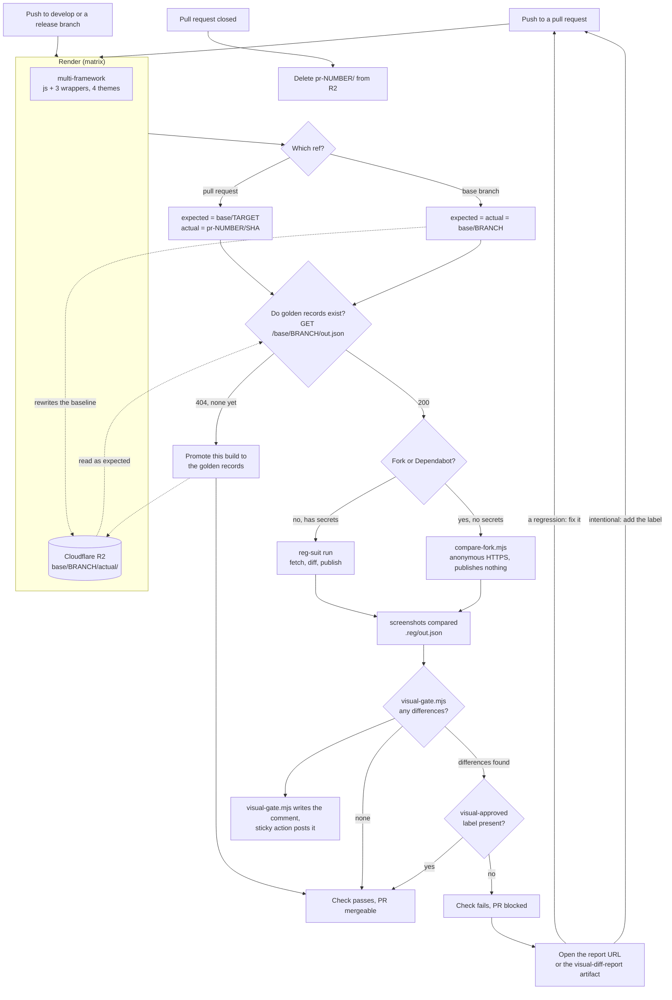

# Handsontable visual testing

To avoid unintended changes to Handsontable's UI, we use visual regression testing.

## Overview

We run visual tests automatically by using the following tools:

| Tool                                                                   | Description                                                                                                                                             |
| ---------------------------------------------------------------------- | ------------------------------------------------------------------------------------------------------------------------------------------------------- |
| [Playwright](https://playwright.dev/docs/intro)                        | An open-source testing framework backed by Microsoft. We use it to write and run visual tests.                                                          |
| [reg-suit](https://github.com/reg-viz/reg-suit)                        | An open-source visual regression suite. We use it to compare screenshots and to publish an HTML report.                                                 |
| [Cloudflare R2](https://developers.cloudflare.com/r2/)                 | Object storage. We use it to hold the golden records and to serve the diff reports.                                                                     |
| [GitHub Actions](https://github.com/handsontable/handsontable/actions) | GitHub's CI platform. We use it to automate our [test workflows](https://github.com/handsontable/handsontable/blob/develop/.github/workflows/test.yml). |

When you push changes to a GitHub pull request:
1. The [Visual tests linter](https://github.com/handsontable/handsontable/actions/workflows/visual-tests-linter.yml)
   workflow checks the code of each visual test.
2. The [Tests](https://github.com/handsontable/handsontable/blob/develop/.github/workflows/test.yml) workflow runs all
   of Handsontable's tests.
3. After all tests pass successfully, the [Visual](https://github.com/handsontable/handsontable/blob/develop/.github/workflows/visual.yml)
   workflow runs the visual tests, then compares the resulting screenshots against the golden records.
4. The golden records come from the branch your pull request targets — usually `develop`. Every build of a
   base branch rewrites that branch's golden records, so a pull request into a release or LTS branch is
   compared against the right baseline with no extra configuration.

If reg-suit spots differences, the **Compare** check on your pull request fails, and you can't merge your
changes. In that case:
1. Open the report. The **Visual** workflow comments the report URL on your pull request. If that URL is
   unreachable, download the `visual-diff-report` artifact from the workflow run instead.
2. Decide what the differences mean:
      - They are a regression. Push a commit that removes them, and the check goes green.
      - They are intentional. Add the `visual-approved` label to the pull request, then re-run the
        **Compare** job. Approval covers the whole build — there is no per-screenshot review.

Approval binds to one set of screenshots. Pushing a new commit removes the `visual-approved` label, so
screenshots nobody has looked at never inherit an earlier approval.

If the branch you target has no golden records yet, the check does not fail. The build promotes its own
screenshots to that branch's golden records and passes, so a fresh branch cannot wedge every pull request
opened against it. The next build of the base branch overwrites them with the authoritative render.

## How the comparison works



Two behaviors are worth reading off the diagram:

- **Approval is all or nothing.** The `visual-approved` label accepts every difference in the build at once. Pushing a new commit removes the label, so an approval covers exactly the screenshots someone looked at.
- **A missing baseline never blocks.** The first build for a branch promotes its own screenshots to the golden records and passes. The next build of that branch replaces them, so an unreviewed baseline survives at most one merge.

## Visual tests structure

Visual tests are divided into:

   - multi-frameworks: tests run on Chromium using classic, horizon, horizon-dark, main and main-dark themes against Handsontable instance created in:
      - Vanilla JS
      - Angular
      - React
      - React (functional)
      - Vue 2
      - Vue 3
   - cross-browser: tests run against vanilla JS Handsontable instance using:
      - Chromium
      - Firefox
      - Webkit

   There is a separate Playwright config for cross-browser tests: `playwright-cross-browser.config.ts`

## Visual tests demos

All the test examples are available at `examples/next/visual-tests` and configured to be served from `localhost:8082`

There main demo available for all frameworks is served on `/`. There are additional demos available only for vanilla JS (to be used with cross-browser tests):

- `/cell-types-demo`,
- `/arabic-rtl-demo`,
- `/custom-style-demo`,
- `/merged-cells-demo`,
- `/nested-headers-demo`,
- `/nested-rows-demo`,

## Run visual tests through GitHub Actions

Our GitHub Actions configuration runs the visual tests automatically, but you can run them manually as well:

1. On GitHub, at the bottom of your pull request, find the **Visual tests** check. Select **Details**.
2. On the left, next to the **Visual tests** job, select 🔄.
3. Select **Re-run jobs**.

## Run visual tests locally

You can manually run visual tests on your machine and then compare the resulting screenshots against the
golden records.

First, prepare your local visual testing environment:

1. Make sure you're using the Node and npm versions mentioned [here](https://handsontable.com/docs/react-data-grid/custom-builds/#build-requirements).
2. From the `./visual-tests/` directory, run `npm install`.
3. In the `./visual-tests/` directory, create a file called `.env`. In the file, add the R2 credentials:
   ```bash
   AWS_ACCESS_KEY_ID=xxx
   AWS_SECRET_ACCESS_KEY=xxx
   R2_BUCKET_NAME=xxx
   R2_ENDPOINT=https://xxx.r2.cloudflarestorage.com
   VISUAL_REPORT_DOMAIN=xxx
   ```
   Ask your supervisor about the values.

To run the visual tests locally:

1. From the `./visual-tests/` directory, run one of the following commands:
   | Command                               | Action                                                                                             |
   | ------------------------------------- | -------------------------------------------------------------------------------------------------- |
   | `npm run test`                        | Run multi-framework visual tests,<br>for all the configured frameworks,<br>using Chromium only. |
   | `npm run test:cross-browser`                        | Run cross-browser visual tests,<br>using vanilla JS framework,<br>for all the supported browsers. <br> You can pass the test name to run a single cross-browser test: `npm run test:cross-browser borders`|
   | `npx playwright test {{ file name }}` | Run a specific test.<br><br>For example: `npx playwright test mouse-wheel`                         |

   The resulting screenshots are saved in `./visual-tests/screenshots/`.
2. From the `./visual-tests/` directory, set the snapshot keys and run the comparison:
   ```bash
   REG_EXPECTED_KEY=base/develop REG_ACTUAL_KEY=local/$(git rev-parse --short HEAD) npm run compare
   ```
   A local run never writes to `base/`, so it cannot overwrite a golden record.
3. Open the report URL printed in the terminal, or open `./visual-tests/.reg/index.html` directly.

## Write a new visual test

To add a new visual test:

1. On your machine, in the `./visual-tests/tests/` directory, create a new `.spec.ts` file.<br>
   Give your file a descriptive name. This name is later used in test logs and screenshot names.
      - ✅ Good: `open-dropdown-menu.spec.ts`.
      - ❌ Bad: `my-test-1.spec.ts`.
2. Copy the template code from `./visual-tests/tests/.empty-test-template.ts` into your file.
3. Write your test. For more information, see:
      - [Playwright's docs](https://playwright.dev/docs/writing-tests)
      - [Helpers](#helpers)
      - [Take screenshots](#take-screenshots)
4. Push your changes to a pull request.<br>
   The [Visual tests linter](https://github.com/handsontable/handsontable/actions/workflows/visual-tests-linter.yml)
   workflow checks the code of your test.

### Take screenshots

To capture a [screenshot](https://playwright.dev/docs/screenshots) and save it to a file,
add this line anywhere in your test:

```js
await page.screenshot({ path: helpers.screenshotPath() });
```

In each test, you can take as many screenshots as you want. For example:

```js
await cell.click();
await page.screenshot({ path: helpers.screenshotPath() });
await anotherCell.click();
await page.screenshot({ path: helpers.screenshotPath() });
```

To take a screenshot of a specific element of Handsontable,
use Playwright's [`locator()`](https://playwright.dev/docs/locators#locate-by-css-or-xpath) method. For example:

```js
const dropdownMenu = page.locator(helpers.selectors.dropdownMenu);

await dropdownMenu.screenshot({ path: helpers.screenshotPath() });
```

For cross-browser tests we are using
```js
  await page.screenshot({ path: helpers.screenshotMultiUrlPath(testFileName, url, suffix) });
```
for easier screenshot identification.

### Helpers

To write tests faster, use the custom helper functions and variables stored in the `./visual-tests/src/helpers.ts` file.

#### `modifier`

Returns the current modifier key: `Ctrl` for Windows or `Meta` for Mac.

```js
// copy the contents of the selected cell
await page.keyboard.press(`${helpers.modifier}+c`);
```

#### `isMac`

Returns `true` if the test runs on Mac.

```js
if (helpers.isMac) {
  // do something
}
```

#### `findCell()`

Returns the specified cell.

Syntax: `findCell({ row: number, cell: number, cellType: 'td / th' })`.

```js
const cell = helpers.tbody.locator(helpers.findCell({ row: 2, cell: 2, cellType: 'td' }));

await cell.click();
```

#### `findDropdownMenuExpander()`

Returns the button that expands the dropdown menu
(also known as [column menu](https://handsontable.com/docs/react-data-grid/column-menu/)) of the specified column.

Syntax: `findDropdownMenuExpander({ col: number })`.

```js
// select the column menu button of the second column
const changeTypeButton = table.locator(helpers.findDropdownMenuExpander({ col: 2 }));

await changeTypeButton.click();
```
