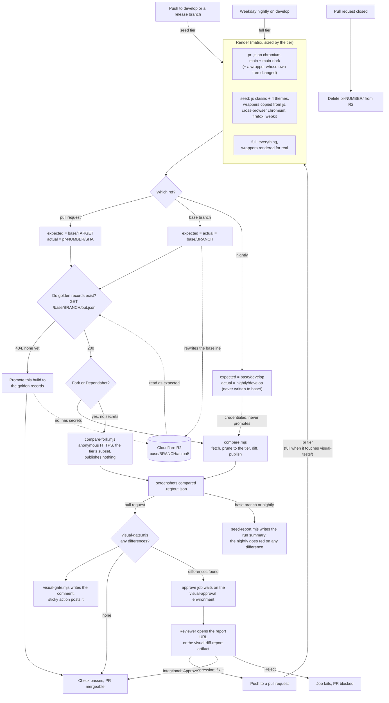

# Handsontable visual testing

To avoid unintended changes to Handsontable's UI, we use visual regression testing.

## Overview

We run visual tests automatically by using the following tools:

| Tool                                                                   | Description                                                                                                                                             |
| ---------------------------------------------------------------------- | ------------------------------------------------------------------------------------------------------------------------------------------------------- |
| [Playwright](https://playwright.dev/docs/intro)                        | An open-source testing framework backed by Microsoft. We use it to write and run visual tests.                                                          |
| [reg-suit](https://github.com/reg-viz/reg-suit)                        | An open-source visual regression suite. We use it to compare screenshots and to publish an HTML report.                                                 |
| [Cloudflare R2](https://developers.cloudflare.com/r2/)                 | Object storage. We use it to hold the golden records and to serve the diff reports.                                                                     |
| [GitHub Actions](https://github.com/handsontable/handsontable/actions) | GitHub's CI platform. We use it to automate our [test workflows](https://github.com/handsontable/handsontable/blob/develop/.github/workflows/test.yml). |

When you push changes to a GitHub pull request:
1. The **Lint / visual tests** check ([`lint.yml`](https://github.com/handsontable/handsontable/blob/develop/.github/workflows/lint.yml))
   checks the code of each visual test.
2. The [Tests](https://github.com/handsontable/handsontable/blob/develop/.github/workflows/test.yml) workflow runs all
   of Handsontable's tests.
3. After all tests pass successfully, the [Visual](https://github.com/handsontable/handsontable/blob/develop/.github/workflows/visual.yml)
   workflow renders the **`pr` tier** — the vanilla JS tests on Chromium with the `main` and `main-dark`
   themes, plus a wrapper when your change is in its scope — and compares the screenshots against the
   matching golden records. A pull request that touches the visual tests themselves (`visual-tests/` or
   `examples/next/visual-tests/`) renders everything instead. The other themes, browsers, and wrappers are rendered by the base branch's seed and by the
   weekday nightly; see [Tiers](#tiers).
4. The golden records come from the branch your pull request targets — usually `develop`. Every seed-tier
   build of a base branch rewrites that branch's golden records, so a pull request into `develop`, `master`, or a
   release branch is compared against the right baseline with no extra configuration. On `develop` the
   seed is its own workflow, `Visual seed` (`.github/workflows/visual-seed.yml`), which runs on every push
   under a concurrency group that never cancels, so the last push of any burst is always seeded, usually
   within about 15 minutes; `master` and the release branches seed through their own pipelines as before.

   That window is the one thing to know before you read a diff: a pull request opened in the middle of a
   burst, or in the quarter of an hour after the last push, is compared against a baseline that does not
   yet contain every merged commit. If a difference looks like someone else's change, check whether the
   latest `Visual seed` run has finished before assuming it is yours.

   **Exception — LTS branches.** No workflow currently runs the visual tests on a push to `lts/*`, so an
   LTS baseline is created by the first pull request into that branch and is never replaced. Later LTS
   pull requests are therefore compared against one contributor's unreviewed screenshots. Treat an LTS
   result as advisory until an LTS push trigger exists.

If reg-suit spots differences, the **Visual / approve** job of your pull request's Tests run waits for a
reviewer, and `CI Gate` waits with it, so you can't merge yet. In that case:
1. Open the report. The **Visual** workflow comments the report URL on your pull request. If that URL is
   unreachable, download the `visual-diff-report` artifact from the workflow run instead.
2. Decide what the differences mean:
      - They are a regression. Push a commit that removes them; the next run compares again and the
        approval request goes away on its own.
      - They are intentional. A reviewer opens the workflow run and selects **Review pending
        deployments → visual-approval → Approve** (the deployment's "View deployment" button opens the
        report). One click: no new commit, no re-run. **Reject** turns the run red. Approval covers the
        whole build — there is no per-screenshot review — so read the report first.

Approval binds to one run. A new push starts a new run and asks again, so screenshots nobody has looked at
never inherit an earlier approval. GitHub records who approved and any comment they left, and the comment
on your pull request is rewritten to name them, so it stops asking for a review that has already happened.

Two cases worth knowing:

- **Your pull request comes from a fork, or from Dependabot.** Those runs get no secrets and publish no
  report, so the `visual-diff-report` artifact on the run holds the images and the job summary carries
  the verdict. The approval works exactly the same: a maintainer approves the pending deployment.
- **A visual change merged into the branch you target.** The golden records always come from that branch's
  latest build, so once someone else's intentional change lands, your next run inherits their differences
  as well as yours. **Rebase** — approving would also approve any real regression of your own that the same
  build contains.

If the branch you target has no golden records yet, the check does not fail. The build promotes its own
screenshots to that branch's golden records and passes, so a fresh branch cannot wedge every pull request
opened against it. The next build of the base branch overwrites them with the authoritative render — on
every base branch except `lts/*`, which has no push trigger (see the exception above).

## Tiers

A full render is 1646 screenshots and adds about 15 minutes to a pull request run, and in 82 measured pull
requests no real regression was confined to one theme, one browser, or one wrapper. So a pull request
renders the variants that catch regressions, and the rest are rendered by the seed right after the merge
and reported back to the merged pull request. The tiers are `VISUAL_TIERS` in `visual-tests/src/config.mjs`;
`visual.yml` receives the one to render as its `tier` input.

| Tier | When | Renders | Compared against | Writes the golden records? |
|---|---|---|---|---|
| `pr` | every pull request | vanilla JS on Chromium, `main` + `main-dark`; a wrapper only when the change touches that wrapper's own `wrappers/<pkg>/` tree | the matching subset of the target branch's golden records | no |
| `seed` | a push to `develop` (`Visual seed`), `master`, or a release branch | vanilla JS in the classic delivery path and all four themes, the cross-browser tests, and the wrapper records copied from the JS render | the branch's previous golden records | yes — this is what a pull request compares against |
| `full` | the weekday nightly on `develop` (`Visual nightly`); a pull request that touches `visual-tests/` or `examples/next/visual-tests/` | everything, with the wrappers rendered for real | the golden records of `develop` (nightly) or of the target branch (pull request) | never — the nightly publishes its report to `nightly/develop/` |

Two things cover what a pull request does not render. The develop seed renders the classic path, all four
themes, and the cross-browser tests minutes after each merge, and when the merge changed any of those it
**comments the list on the merged pull request** (the `Visual seed` run summary carries the same list),
so a horizon-only, Firefox-only, or WebKit-only change is attributed to its author the same afternoon,
and those renders are now the golden records. The nightly is the only build that renders the wrappers for
real (the seed copies the vanilla JS render into their golden records), and it turns red on any
difference from the seed: a wrapper that no longer renders like vanilla JS, a flaky or poisoned golden
record, or a commit whose seed never landed. A theme-only regression cannot red the nightly, because the
seed has already made it the baseline; the seed's comment is where it shows. `visual-tests/AGENTS.md`
has the diagnostic for a red nightly.

## How the comparison works



Two behaviors are worth reading off the diagram:

- **Approval is all or nothing, and one click.** A `changed` verdict holds the run on the `visual-approval` environment; the reviewer approves or rejects the pending deployment on the run page. An approval covers exactly the screenshots of that run: a new push is a new run and asks again.
- **A missing baseline never blocks.** The first build for a branch promotes its own screenshots to the golden records and passes. The next build of that branch replaces them, so an unreviewed baseline survives at most one merge.
- **The nightly reads the golden records and never writes them.** It renders the wrappers for real, while the golden records hold the JS render copied into them, so its shape is not the baseline's. Its report lives at `nightly/develop/` and is rewritten each night; a red nightly means develop changed since the seed, or a golden record went bad.

## Visual tests structure

Visual tests are divided into:

   - multi-frameworks: tests run on Chromium against a Handsontable instance created in each framework the
     tier renders (see [Tiers](#tiers) — a pull request renders vanilla JS with the `main` and `main-dark`
     themes; the seed and the nightly render the classic delivery path and all four themes too):
      - Vanilla JS
      - Angular
      - React
      - Vue 3
   - cross-browser: tests run against vanilla JS Handsontable instance using:
      - Chromium
      - Firefox
      - Webkit

   There is a separate Playwright config for cross-browser tests: `playwright-cross-browser.config.ts`

## Visual tests demos

All the test examples are available at `examples/next/visual-tests` and configured to be served from `localhost:8082`

There main demo available for all frameworks is served on `/`. There are additional demos available only for vanilla JS (to be used with cross-browser tests):

- `/cell-types-demo`,
- `/arabic-rtl-demo`,
- `/custom-style-demo`,
- `/merged-cells-demo`,
- `/nested-headers-demo`,
- `/nested-rows-demo`,

## Run visual tests through GitHub Actions

Our GitHub Actions configuration runs the visual tests automatically; approving intentional differences
needs no re-run. To render again by hand (a flake you want to rule out):

1. On GitHub, at the bottom of your pull request, find the **Visual / Compare** check. Select **Details**.
2. On the left, next to the **Compare** job, select 🔄.
3. Select **Re-run jobs**.

## Run visual tests locally

You can manually run visual tests on your machine and then compare the resulting screenshots against the
golden records.

First, prepare your local visual testing environment:

1. Make sure you're using the Node and npm versions mentioned [here](https://handsontable.com/docs/react-data-grid/custom-builds/#build-requirements).
2. From the `./visual-tests/` directory, run `npm install`.
3. In the `./visual-tests/` directory, create a file called `.env`. In the file, add the R2 credentials:
   ```bash
   AWS_ACCESS_KEY_ID=xxx
   AWS_SECRET_ACCESS_KEY=xxx
   R2_BUCKET_NAME=xxx
   R2_ENDPOINT=https://xxx.r2.cloudflarestorage.com
   VISUAL_REPORT_DOMAIN=xxx
   ```
   Ask your supervisor about the values.

To run the visual tests locally:

1. From the `./visual-tests/` directory, run one of the following commands:
   | Command                               | Action                                                                                             |
   | ------------------------------------- | -------------------------------------------------------------------------------------------------- |
   | `VISUAL_TIER=pr npm run build && VISUAL_TIER=pr npm run test` | Render what a pull request renders (the `pr` tier):<br>the vanilla JS tests on Chromium with the `main` and `main-dark` themes.<br>Skips the wrapper installs (Angular alone is about two minutes) and the other themes. |
   | `npm run test`                        | Run multi-framework visual tests on Chromium<br>for the tier the branch resolves to: everything on a feature branch (`full`),<br>vanilla JS copied into the wrappers on `develop` (`seed`). |
   | `npm run test:cross-browser`                        | Run cross-browser visual tests,<br>using vanilla JS framework,<br>for all the supported browsers. <br> You can pass the test name to run a single cross-browser test: `npm run test:cross-browser borders`|
   | `npx playwright test {{ file name }}` | Run a specific test.<br><br>For example: `npx playwright test mouse-wheel`                         |

   The resulting screenshots are saved in `./visual-tests/screenshots/`.
2. From the `./visual-tests/` directory, set the snapshot keys and run the comparison:
   ```bash
   REG_EXPECTED_KEY=base/develop REG_ACTUAL_KEY=local/$(git rev-parse --short HEAD) npm run compare
   ```
   `compare` loads `./.env` itself if the file exists, so the credentials from step 3 are picked up
   without exporting them by hand. If you rendered the `pr` tier, prefix this command with `VISUAL_TIER=pr`
   as well, so the golden records are trimmed to the same subset; otherwise the report lists every record
   you did not render as deleted.
   A local run never writes to `base/`, so it cannot overwrite a golden record.
3. Open the report URL printed in the terminal, or open `./visual-tests/.reg/index.html` directly.

## Write a new visual test

To add a new visual test:

1. On your machine, in the `./visual-tests/tests/` directory, create a new `.spec.ts` file.<br>
   Give your file a descriptive name. This name is later used in test logs and screenshot names.
      - ✅ Good: `open-dropdown-menu.spec.ts`.
      - ❌ Bad: `my-test-1.spec.ts`.
2. Copy the template code from `./visual-tests/tests/.empty-test-template.ts` into your file.
3. Write your test. For more information, see:
      - [Playwright's docs](https://playwright.dev/docs/writing-tests)
      - [Helpers](#helpers)
      - [Take screenshots](#take-screenshots)
4. Push your changes to a pull request.<br>
   The **Lint / visual tests** check ([`lint.yml`](https://github.com/handsontable/handsontable/blob/develop/.github/workflows/lint.yml))
   checks the code of your test.

### Take screenshots

To capture a [screenshot](https://playwright.dev/docs/screenshots) and save it to a file,
add this line anywhere in your test:

```js
await page.screenshot({ path: helpers.screenshotPath() });
```

Capture one screenshot per distinct visual state, and assert that state first (`await expect(locator).toBeFocused()`, `.toBeVisible()`, …) — a capture straight after an action photographs whichever half of the transition the runner reached. The determinism rules are in `AGENTS.md`. For example:

```js
await cell.click();
await page.screenshot({ path: helpers.screenshotPath() });
await anotherCell.click();
await page.screenshot({ path: helpers.screenshotPath() });
```

To take a screenshot of a specific element of Handsontable,
use Playwright's [`locator()`](https://playwright.dev/docs/locators#locate-by-css-or-xpath) method. For example:

```js
const dropdownMenu = page.locator(helpers.selectors.dropdownMenu);

await dropdownMenu.screenshot({ path: helpers.screenshotPath() });
```

For cross-browser tests we are using
```js
  await page.screenshot({ path: helpers.screenshotMultiUrlPath(testFileName, url, suffix) });
```
for easier screenshot identification.

### Helpers

To write tests faster, use the custom helper functions and variables stored in the `./visual-tests/src/helpers.ts` file.

#### `modifier`

Returns the current modifier key: `Ctrl` for Windows or `Meta` for Mac.

```js
// copy the contents of the selected cell
await page.keyboard.press(`${helpers.modifier}+c`);
```

#### `isMac`

Returns `true` if the test runs on Mac.

```js
if (helpers.isMac) {
  // do something
}
```

#### `findCell()`

Returns the specified cell.

Syntax: `findCell({ row: number, cell: number, cellType: 'td / th' })`.

```js
const cell = helpers.tbody.locator(helpers.findCell({ row: 2, cell: 2, cellType: 'td' }));

await cell.click();
```

#### `findDropdownMenuExpander()`

Returns the button that expands the dropdown menu
(also known as [column menu](https://handsontable.com/docs/react-data-grid/column-menu/)) of the specified column.

Syntax: `findDropdownMenuExpander({ col: number })`.

```js
// select the column menu button of the second column
const changeTypeButton = table.locator(helpers.findDropdownMenuExpander({ col: 2 }));

await changeTypeButton.click();
```
